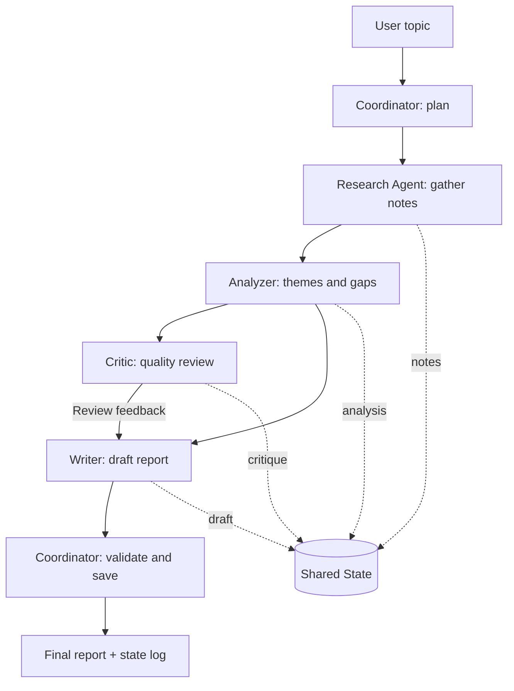

# Multi-Agent Workflow Diagram

```mermaid
flowchart TD
    U[User topic] --> C[Coordinator: plan]
    C --> R[Research Agent: gather notes]
    R --> A[Analyzer: themes and gaps]
    A --> K[Critic: quality review]
    A --> W[Writer: draft report]
    K -->|Review feedback| W
    W --> V[Coordinator: validate and save]
    V --> O[Final report + state log]
    R -. notes .-> S[(Shared State)]
    A -. analysis .-> S
    K -. critique .-> S
    W -. draft .-> S
```

## Shared state fields
`topic`, `plan`, `research_notes`, `analysis`, `critique`, `draft`, `messages`, `status`.
