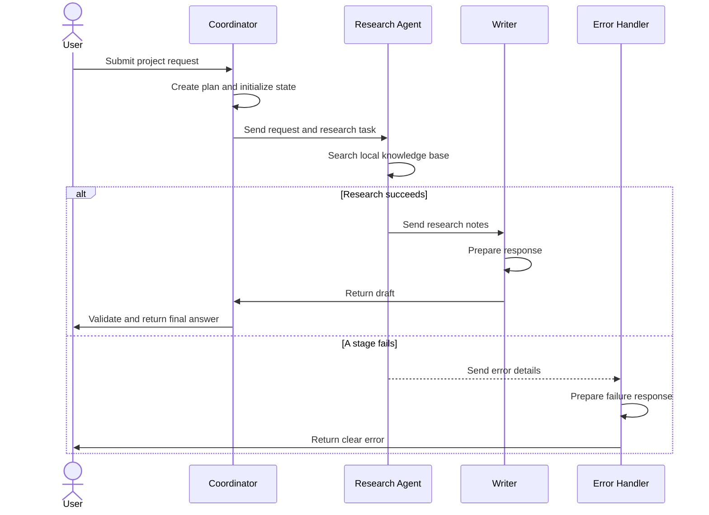

# Sequence Diagram

```mermaid
sequenceDiagram
 actor User
 participant C as Coordinator
 participant R as Research Agent
 participant W as Writer
 participant E as Error Handler
 User->>C: Submit project request
 C->>C: Create plan and initialize state
 C->>R: Send request and research task
 R->>R: Search local knowledge base
 alt Research succeeds
   R->>W: Send research notes
   W->>W: Prepare response
   W->>C: Return draft
   C->>User: Validate and return final answer
 else A stage fails
   R-->>E: Send error details
   E->>E: Prepare failure response
   E->>User: Return clear error
 end
```
